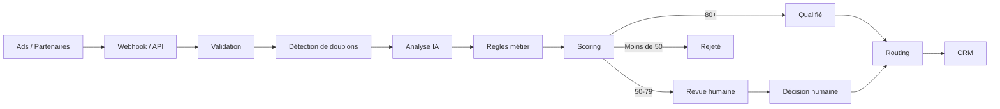

# LeadGuard

**Qualification et routage de leads assistés par IA**

*[🇬🇧 Read in English](README.md) · 🇫🇷 Français*

Un proof of concept technique : une plateforme interne qui reçoit des leads
issus de campagnes marketing, les valide, les déduplique, les enrichit avec un
LLM, les score selon des règles métier déterministes, et route les leads
qualifiés vers la bonne équipe commerciale — avec une piste d'audit complète.

Il couvre six métiers — pompe à chaleur, photovoltaïque, audioprothèse,
assurance santé, rénovation énergétique et IT B2B — sur la France, l'Espagne et
l'Italie. **Un seul pipeline, six jeux de critères d'éligibilité** : ce partage
est le cœur de la conception, et la section ci-dessous explique pourquoi.

---

## Le problème

Les équipes marketing reçoivent un volume important de leads depuis des sources
multiples : Google Ads, Meta Ads, formulaires partenaires, plateformes
d'affiliation. Ces leads arrivent dans des formats différents, avec une qualité
inégale, des doublons, des consentements manquants et des descriptions de projet
en texte libre qu'aucune colonne de base de données ne sait représenter.

Avant qu'un lead ne vaille le temps d'un commercial, il faut le valider, le
dédupliquer, l'enrichir, le qualifier et le router. Le faire à la main ne passe
pas à l'échelle ; le faire avec un seul modèle opaque n'est pas auditable.

## La solution

LeadGuard démontre un pipeline de qualification assisté par IA qui combine
**extraction d'information par LLM** et **règles métier déterministes**.

Cette séparation est la décision d'architecture centrale :

```
Texte libre ──► Extraction IA ──► Informations structurées
                                            │
                                            ▼
                                  Règles déterministes
                                            │
                                            ▼
                                        Scoring
                                            │
                                            ▼
                            Validation humaine si nécessaire
```

Le LLM est utilisé exactement là où il apporte de la valeur : transformer
« j'ai acheté une maison près de Lyon et je voudrais remplacer ma chaudière
fioul par une pompe à chaleur avant l'hiver » en `{project_type: heat_pump,
location: Lyon, urgency: high, ...}`.

**L'IA ne décide jamais si un lead est accepté ou rejeté.** Cette décision est
prise par des règles à poids fixes, dont chaque étape est écrite dans une piste
d'audit avec une raison lisible par un humain. C'est volontaire : les décisions
critiques pour le métier doivent être explicables, reproductibles et testables.
Un LLM n'est aucune des trois.

---

## Six métiers, un seul pipeline

Une activité de génération de leads ne qualifie pas tous les métiers de la même
façon. Un lead pompe à chaleur ne vaut rien sans la propriété du logement ; un
lead IT B2B ne vaut rien sans pouvoir de décision. Aucun de ces deux critères
n'a le moindre sens dans l'autre métier.

Les règles se répartissent donc en deux familles :

| | Poids | S'applique à |
|---|---:|---|
| **Règles universelles** | 68 | tous les leads, tous les métiers |
| **Règles d'éligibilité métier** | 32 | uniquement le métier du lead |
| **Total** | **100** | pour que le score se lise toujours en pourcentage |

Chaque métier définit ses trois ou quatre critères :

| Métier | Critères d'éligibilité |
|---|---|
| **Pompe à chaleur** | statut propriétaire · système de chauffage actuel **et son ancienneté** · surface et type de logement · réalisme du budget |
| **Photovoltaïque** | propriétaire de la toiture concernée · type de couverture et orientation dominante · autoconsommation ou revente de surplus · réalisme du budget |
| **Audioprothèse** | gêne auditive **déclarée par la personne elle-même** · tranche d'âge et situation d'accompagnement · couverture mutuelle et prise en charge |
| **Assurance santé** | nature du besoin (santé / prévoyance / emprunteur) · situation familiale et nombre de bénéficiaires · contrat en cours et date d'échéance |
| **Rénovation énergétique** | propriétaire occupant ou bailleur · ancienneté du logement et type de bien · nature des travaux envisagés · réalisme du budget |
| **IT B2B** | fonction et **pouvoir de décision** du contact · taille de l'entreprise et secteur · nature du projet (logiciel, infogérance, cybersécurité, cloud) |

Trois conséquences à souligner :

**La propriété n'est pas une règle universelle.** C'est un critère
d'éligibilité pour les trois métiers immobiliers, et elle n'existe pas dans les
trois autres — sinon un DSI perdrait 15 points pour ne pas être propriétaire
d'une maison. Un test vérifie exactement cela.

**Le budget n'est un critère que là où il signifie quelque chose.** Il est
évalué face à un coût de référence *propre au métier* (une PAC ≈ 15 000 €, le
solaire ≈ 12 000 €), et il n'existe aucune règle de budget pour
l'audioprothèse, l'assurance santé ou l'IT B2B.

**Un lead dont le métier n'est pas identifiable plafonne à 68/100.** Pas par un
cas particulier — simplement parce que le tiers « éligibilité » de l'échelle
n'a jamais été exécuté. Il ne peut donc jamais être qualifié automatiquement,
et la piste d'audit le dit en clair : *« aucun métier identifié, les critères
d'éligibilité n'ont pas pu être vérifiés »*.

Pour l'audioprothèse et l'assurance santé, le lead touche à des données de
santé, catégorie particulière au sens du RGPD. C'est pourquoi le métier
audioprothèse porte la règle la plus stricte du dispositif : une demande faite
par un proche pour le compte d'un tiers n'est pas un lead qualifié, car la
personne concernée n'a ni exprimé le besoin ni consenti au traitement de ses
données.

---

## Architecture



Les deux points d'entrée convergent sur un pipeline unique, donc la logique
métier n'existe qu'une seule fois :

```
API manuelle ──┐
               ├──► lead_service.process_lead()  ──►  validation
Webhook      ──┘                                     consentement & empreinte
                                                      détection de doublons
                                                      extraction IA
                                                      règles métier
                                                      scoring & décision
                                                      routing
                                                      synchro CRM
                                                      piste d'audit
```

### Organisation du projet

```
backend/
├── app/
│   ├── main.py                     app FastAPI, lifespan, injection
│   ├── config.py                   tous les seuils et réglages, au même endroit
│   ├── api/
│   │   ├── leads.py                POST /api/leads, liste, détail, stats
│   │   ├── webhooks.py             adaptateurs de payload par source
│   │   ├── reviews.py              endpoints de revue humaine
│   │   ├── fake_crm.py             CRM aval simulé
│   │   ├── deps.py                 provider IA & client CRM injectables
│   │   └── serializers.py          mapping modèle → réponse
│   ├── models/                     Lead, LeadEvent, énumérations
│   ├── schemas/lead.py             contrats Pydantic
│   ├── services/
│   │   ├── lead_service.py         LE pipeline (orchestrateur)
│   │   ├── duplicate_service.py    détection de doublons à deux niveaux
│   │   ├── fingerprint.py          empreinte d'intégrité SHA-256
│   │   └── audit_service.py        piste d'événements en append-only
│   ├── qualification/
│   │   ├── rules.py                le registre de règles (les poids sont ici)
│   │   ├── scoring.py              agrégation + score → statut
│   │   └── engine.py               exécute les règles ; aucune I/O
│   ├── ai/
│   │   ├── base.py                 ABC AIProvider + prompt partagé
│   │   ├── mock_provider.py        déterministe, aucune clé API requise
│   │   ├── anthropic_provider.py
│   │   ├── openai_provider.py
│   │   └── factory.py              sélection + dégradation gracieuse
│   ├── routing/router.py           règles de routage déclaratives
│   ├── integrations/crm.py         retry, timeout, isolation des pannes
│   └── db/
│       ├── session.py              engine/session async
│       └── seed.py                 données de démonstration
└── tests/                          142 tests, aucun réseau requis

frontend/
└── src/
    ├── pages/                      Dashboard, NewLead, LeadDetail, Reviews, Crm
    ├── components/common.jsx       score, badges, checks, timeline
    └── api/client.js
```

---

## Installation

### Option 1 — Docker (une seule commande)

```bash
docker compose up --build
```

* Frontend : <http://localhost:3000>
* Documentation de l'API : <http://localhost:8000/docs>

Lance PostgreSQL, l'API et le frontend derrière nginx. Comme
`SEED_ON_STARTUP=true`, la base est **réinitialisée avec le jeu de données de
démonstration à chaque démarrage** — le dashboard est donc toujours peuplé et
chaque démo repart du même état propre. Passe la variable à `false` dans
`docker-compose.yml` pour conserver les leads entre deux redémarrages.

Si le port 8000 ou 3000 est déjà occupé sur ta machine :

```bash
BACKEND_PORT=8010 FRONTEND_PORT=3001 docker compose up --build
```

### Option 2 — En local (SQLite, sans Docker)

```bash
# Backend
cd backend
python3 -m venv .venv && source .venv/bin/activate
pip install -r requirements-dev.txt
python -m app.db.seed                 # optionnel : données de démo
uvicorn app.main:app --reload         # http://localhost:8000

# Frontend (dans un autre terminal)
cd frontend
npm install
npm run dev                           # http://localhost:5173
```

Aucune clé API n'est nécessaire : `AI_PROVIDER=mock` est la valeur par défaut,
et le provider mock est un extracteur pleinement fonctionnel et déterministe.

Si le port 8000 est occupé, lance l'API ailleurs et pointe le proxy dessus :

```bash
uvicorn app.main:app --port 8010
VITE_API_TARGET=http://localhost:8010 npm run dev
```

### Configuration

Copie `backend/.env.example` vers `backend/.env` et ajuste. Tout ce qui vaut la
peine d'être réglé est un paramètre : seuils, comportement des règles, pénalité
de doublon, retry et timeout du CRM, provider IA.

Pour utiliser un vrai LLM :

```bash
AI_PROVIDER=openai
OPENAI_API_KEY=sk-...
```

ou

```bash
AI_PROVIDER=anthropic
ANTHROPIC_API_KEY=sk-ant-...
```

> `.env` est dans `.gitignore` : ta clé ne sera jamais commitée.
> `uvicorn` doit être lancé **depuis le dossier `backend/`** pour que le `.env`
> soit lu.

### Tests

```bash
cd backend
python -m pytest              # 142 tests, ~5 s, sans réseau ni clé API
```

---

## Endpoints

| Méthode | Chemin | Rôle |
|---|---|---|
| `POST` | `/api/leads` | Soumettre un lead et exécuter tout le pipeline |
| `GET` | `/api/leads` | Lister les leads (`?status=QUALIFIED\|REVIEW\|REJECTED`) |
| `GET` | `/api/leads/{id}` | Détail complet : analyse IA, règles, routing, audit |
| `GET` | `/api/leads/stats` | Compteurs du dashboard |
| `POST` | `/api/webhooks/leads` | Recevoir un lead depuis une plateforme externe |
| `GET` | `/api/reviews` | Leads en attente de revue humaine |
| `POST` | `/api/reviews/{id}` | Enregistrer une décision humaine |
| `POST` | `/api/fake-crm/leads` | Réception CRM simulée |
| `GET` | `/api/fake-crm/leads` | Voir ce que le CRM a reçu |
| `GET` | `/api/config` | Seuils, poids des règles et personas de démo |
| `GET` | `/health` | Health check |

### Exemple

```bash
curl -X POST http://localhost:8000/api/leads \
  -H 'Content-Type: application/json' \
  -d '{
    "firstname": "Thomas",
    "lastname": "Martin",
    "email": "thomas.martin@email.fr",
    "phone": "0612345678",
    "postal_code": "69003",
    "source": "google_ads",
    "campaign": "PAC_Lyon",
    "project_description": "J'\''ai acheté une maison près de Lyon et je souhaite remplacer ma chaudière fioul par une pompe à chaleur dans ma maison de 120m2 avant l'\''hiver.",
    "owner": true,
    "budget": 12000,
    "consent": true
  }'
```

Réponse (abrégée) :

```json
{
  "public_id": "LD-2026-0006",
  "score": 94,
  "status": "QUALIFIED",
  "vertical": "heat_pump",
  "team": "PAC Lyon",
  "crm_status": "SUCCESS",
  "duplicate": { "duplicate": false, "reason": "No duplicate found" },
  "ai_analysis": {
    "project_type": "heat_pump",
    "location": "Lyon",
    "property_type": "house",
    "owner_intent": true,
    "urgency": "high",
    "purchase_intent": "high",
    "summary": "Prospect interested in a heat pump project: ...",
    "provider": "mock",
    "details": {
      "heating_system": "oil_boiler",
      "heating_age_years": null,
      "surface_m2": 120
    }
  }
}
```

Et la piste d'audit produite :

```
12:32:59  Lead received from google_ads (campaign PAC_Lyon) via api
12:32:59  Validation passed: all required fields present and well-formed
12:32:59  Consent verified and timestamped at 2026-09-09 10:32:59 UTC
12:32:59  Duplicate check passed
12:32:59  AI analysis completed by 'mock': project=heat_pump, urgency=high, intent=high
12:32:59  Score calculated: 94/100 (10 checks: universal + heat_pump)
12:32:59  Status set to QUALIFIED: Score 94 is at or above the qualification threshold (80)
12:32:59  Routed to PAC Lyon: Heat pump project located in the Rhône-Alpes area
12:32:59  CRM synchronization successful (reference CRM-C07301DF)
```

### Webhooks

Le même pipeline accepte des payloads au format natif des plateformes. Chaque
source a un petit adaptateur qui mappe ses noms de champs vers le schéma
interne — le `user_column_data` de Google Ads, le `field_data` de Meta Ads, les
formulaires partenaires français (`prenom`/`nom`/`telephone`), et un fallback
générique. Les valeurs sont converties au passage (`"oui"` → `true`,
`"12 000 €"` → `12000.0`).

```bash
curl -X POST http://localhost:8000/api/webhooks/leads \
  -H 'Content-Type: application/json' \
  -d '{
    "source": "google_ads",
    "campaign_name": "PAC_Lyon",
    "user_column_data": [
      {"column_id": "FIRST_NAME", "string_value": "Thomas"},
      {"column_id": "EMAIL", "string_value": "thomas.martin@email.fr"},
      {"column_id": "PHONE_NUMBER", "string_value": "0612345678"},
      {"column_id": "POSTAL_CODE", "string_value": "69003"}
    ],
    "project_description": "Pompe à chaleur pour ma maison avant l'\''hiver",
    "owner": "true", "budget": "12 000 €", "consent": "yes"
  }'
```

---

## Le pipeline de qualification

### 1. Validation

Pydantic valide la **forme et la présence** : champs obligatoires, email
parsable, description non vide, budget non négatif. Un payload
structurellement cassé reçoit un `422` et ne devient jamais un lead.

### 2. Consentement et traçabilité

Chaque lead stocke son consentement, un timestamp de consentement, sa source et
une **empreinte SHA-256** des champs identifiants :

```python
hashlib.sha256(json.dumps(data, sort_keys=True).encode()).hexdigest()
```

La description en texte libre est volontairement exclue, pour qu'une
reformulation du message ne change pas l'identité du lead. `sort_keys=True`
rend l'empreinte indépendante de l'ordre des clés.

### 3. Détection de doublons

Deux niveaux, du moins coûteux au plus coûteux, et toujours **avant**
l'insertion pour qu'un lead ne soit jamais comparé à lui-même :

1. Correspondance exacte sur un email ou un téléphone **normalisé**
   (`+33 6 12 34 56 78` et `0612345678` donnent la même clé) → similarité
   94-100 %.
2. Signaux faibles exigeant deux dimensions concordantes — similarité de nom
   *et* code postal — afin d'éviter les faux positifs.

L'ensemble des candidats est réduit en SQL sur des colonnes normalisées et
indexées, puis scoré finement en Python.

### 4. Analyse IA

Le provider a une seule mission : du texte libre en entrée, des champs
structurés en sortie.

```python
class AIProvider(ABC):
    @abstractmethod
    async def analyze_lead(self, lead: LeadCreate) -> AIAnalysis: ...
```

Trois implémentations partagent un même prompt et un même schéma de sortie :
`MockAIProvider` (mots-clés déterministes, sans clé), `AnthropicProvider` et
`OpenAIProvider` (tous deux en sortie JSON structurée).

À côté des champs communs à tous les leads, le provider renvoie un sac
`details` contenant les champs qui ne comptent que pour un métier — système de
chauffage et ancienneté, couverture et orientation de toiture, pouvoir de
décision, date d'échéance de contrat. C'est une seule colonne JSON plutôt que
vingt colonnes nullables, parce que chaque métier n'en utilise qu'une poignée.
L'extraction est ciblée : on ne demande jamais l'orientation de la toiture pour
un lead pompe à chaleur.

Une panne du provider ne perd jamais un lead : `analyze_safely` capture les
erreurs et les timeouts, et renvoie une analyse neutre. Les règles scorent alors
les champs structurés soumis par le prospect, et le lead part simplement en
revue humaine.

### 5. Règles métier

Chaque règle est une petite fonction pure qui renvoie **des points, un verdict
et une raison**, enregistrée dans une seule liste. Ajouter ou repondérer une
règle est un changement d'une ligne et ne demande aucune modification du moteur.

```json
{
  "rule": "owner_check",
  "passed": true,
  "score": 15,
  "max_score": 15,
  "reason": "Lead is a property owner"
}
```

**Règles universelles — 68 points, tous les leads**

| Règle | Max | Ce qu'elle vérifie |
|---|---:|---|
| `consent_check` | 20 | Consentement RGPD accordé — la règle la plus lourde |
| `project_consistency_check` | 12 | Métier identifiable **et** description substantielle |
| `purchase_intent_check` | 10 | Forte (10) / moyenne (5) / faible (0) — extraction IA |
| `urgency_check` | 10 | Forte (10) / moyenne (5) / faible (0) — extraction IA |
| `email_check` | 8 | Valide, domaine non jetable |
| `phone_check` | 8 | Numéro valide **pour le pays du lead** (FR / ES / IT) |
| `duplicate_check` | −40 | pénalité seule : elle peut retirer, jamais ajouter |

**Règles d'éligibilité — 32 points, le métier du lead**

| Métier | Règles et poids |
|---|---|
| Pompe à chaleur | `hp_owner` 11 · `hp_current_heating` 8 · `hp_property` 6 · `hp_budget` 7 |
| Photovoltaïque | `pv_roof_owner` 11 · `pv_roof_profile` 7 · `pv_usage_model` 7 · `pv_budget` 7 |
| Audioprothèse | `ha_self_declared` 12 · `ha_age_context` 10 · `ha_coverage` 10 |
| Assurance santé | `hi_need_type` 11 · `hi_household` 10 · `hi_contract_timing` 11 |
| Rénovation énergétique | `er_owner_type` 10 · `er_property_age` 8 · `er_works_type` 7 · `er_budget` 7 |
| IT B2B | `b2b_decision_power` 12 · `b2b_company_profile` 10 · `b2b_project_type` 10 |

Les règles sont graduées, pas binaires, partout où la raison métier est réelle.
Le critère PAC est le système actuel **et son ancienneté** : nommer le système
rapporte 5 sur 8, nommer les deux rapporte 8. C'est pourquoi Thomas obtient 94
et non 100 — voir *Choix techniques*.

### 6. Décision

```
score >= 80          → QUALIFIED
50 <= score < 80     → REVIEW
score < 50           → REJECTED
```

Les seuils vivent dans `config.py` et sont surchargeables par variable
d'environnement. Un doublon suspecté est plafonné à `REVIEW` et jamais qualifié
automatiquement — un humain confirme s'il s'agit d'une véritable reprise de
contact ou d'une double soumission.

### 7. Humain dans la boucle

Le verdict du relecteur est stocké **à côté** de celui du moteur, jamais
par-dessus :

```json
{
  "system_status": "REVIEW",
  "human_status": "QUALIFIED",
  "reviewer": "demo-user",
  "reviewed_at": "2026-09-09T14:31:21",
  "review_reason": "Ownership confirmed by phone"
}
```

Garder les deux est ce qui permet d'auditer les décisions et, plus tard, de
mesurer la fréquence des désaccords entre humains et moteur — le signal qu'on
utiliserait pour repondérer les règles. Le score n'est jamais réécrit. Un
passage humain à `QUALIFIED` déclenche exactement le même flux aval qu'une
qualification automatique : routing, puis synchro CRM.

### 8. Routing

Une liste de règles déclaratives évaluée de haut en bas, première correspondance
gagnante, avec un fallback toujours vrai pour qu'un lead qualifié ne reste
jamais orphelin.

```json
{ "team": "PAC Lyon", "reason": "Heat pump project located in the Rhône-Alpes area" }
```

Le routage s'appuie d'abord sur le métier — chacun est acheté par une équipe
cliente différente — puis affine selon la géographie ou la forme du deal :

* **Le pays d'abord.** Un lead espagnol part à l'*Iberia Desk* et un lead
  italien à l'*Italy Desk*, avant toute considération de région française.
* **Pompe à chaleur** → *PAC Lyon* (Rhône-Alpes), *PAC Paris* (Île-de-France),
  *PAC National* ailleurs.
* **Photovoltaïque** → *Solar South* dans les départements les plus ensoleillés,
  *Solar National* ailleurs.
* **Rénovation énergétique** → *Renovation Global* pour une rénovation globale,
  *Renovation National* pour un geste unique.
* **Audioprothèse** → *Audio Île-de-France* ou *Audio National*, selon le
  réseau de centres d'appareillage.
* **Assurance santé** → *Assurance Emprunteur*, *Prévoyance* ou *Santé
  Individuelle*, selon la nature du besoin.
* **IT B2B** → *IT Enterprise* ou *IT SMB*, selon la taille de l'entreprise.
* **Aucun métier** → *General Sales*.

Un test vérifie que chaque métier possède son propre desk, pour qu'un nouveau
métier ne puisse jamais retomber silencieusement sur le desk généraliste.

### 9. Synchronisation CRM

Seuls les leads `QUALIFIED` sont poussés. Le client a un timeout, un retry borné
avec backoff exponentiel et des logs structurés — mais la propriété importante
est l'**isolation des pannes** : une indisponibilité du CRM est enregistrée en
`crm_status=FAILED` avec l'erreur et la raison dans la piste d'audit. La requête
d'entrée renvoie quand même `201` et le lead reste qualifié dans LeadGuard,
prêt à être repoussé. Une panne aval ne doit jamais perdre un lead.

### 10. Piste d'audit

Des lignes `lead_events` en append-only — `event_type`, `message`, `metadata`
JSON, `created_at` — écrites de façon atomique avec le changement d'état
qu'elles décrivent. Rien n'est jamais modifié ni supprimé : la piste est la
preuve qu'une décision a été prise pour les raisons annoncées.

---

## Démo (environ 3 minutes)

```bash
docker compose up --build      # ou l'option locale ci-dessus
```

Le dashboard s'ouvre avec du volume et un historique de revue. Les trois
personas de démo ne sont volontairement **pas** en base — tu les crées en
direct, et la page **New lead** a un bouton de préremplissage pour chacun, donc
tu ne saisis jamais 11 champs à la main.

| Étape | Action | Résultat attendu |
|---|---|---|
| 1 | **New lead** → préremplir *Thomas — pompe à chaleur, excellent* → soumettre | `94/100` · **QUALIFIED** · PAC Lyon · CRM SUCCESS |
| 2 | Ouvrir le détail du lead | l'extraction IA **avec les champs propres à la PAC** (`heating_system: oil_boiler`, `surface_m2: 120`), les 10 règles avec leurs raisons, le routage et les 9 étapes d'audit |
| 3 | Préremplir *Laura — solaire, incomplet* → soumettre | `72/100` · **REVIEW**. Sa couverture de toit, son orientation et son modèle d'autoconsommation ont tous été extraits et crédités ; ce sont *« Roof ownership not confirmed »* et *« No budget provided »* qui la retiennent |
| 4 | Cliquer **QUALIFY** sur Laura | système `REVIEW` + humain `QUALIFIED` conservés tous les deux, routée vers Solar South, CRM synchronisé, décision dans l'audit |
| 5 | Préremplir *Thomas* à nouveau → soumettre | **Potential duplicate detected** — lead existant `LD-…`, similarité 100 % · score `54` (94 − 40) · plafonné à REVIEW |
| 6 | Préremplir *Marco — aucun métier, mauvais* → soumettre | `8/68` · **REJECTED**. La piste d'audit dit *« aucun métier identifié, les critères d'éligibilité n'ont pas pu être vérifiés »* — le plafond est la conception, pas un cas particulier |
| 7 | Préremplir *Bernard — demande pour un proche* → soumettre | `66/100` · **REVIEW** — *« Enquiry made on behalf of a third party: the person concerned has not declared the difficulty themselves »*. La règle la plus stricte du métier audioprothèse |
| 8 | Préremplir *Kevin — IT B2B, sans pouvoir* → soumettre | `67/100` · **REVIEW** — *« Contact influences but does not decide: a decision-maker is still needed »*. Même pipeline, critères complètement différents |
| 9 | **Dashboard** | le tableau **By vertical** : volume, taux de qualification et score moyen par métier |
| 10 | Onglet **CRM** | exactement les leads qualifiés, avec leurs références CRM |

Deux personas à comparer côte à côte, parce qu'ils rendent l'architecture
visible en dix secondes : **Sylvie** (IT B2B, décideuse, 100/100) et **Kevin**
(IT B2B, technicien, 67/100). Même métier, même pipeline — la différence tient
à un seul critère d'éligibilité, et le score le nomme.

### La seule branche que le script ci-dessus ne couvre pas

La panne du CRM. Mets `CRM_FAIL_RATE=1` (dans `backend/.env`, ou sur le service
`backend` de `docker-compose.yml`) et soumets un bon lead :

* la requête renvoie quand même `201`
* le lead est toujours à `94/100`, `QUALIFIED` et routé vers PAC Lyon
* la page de détail affiche une bannière orange **CRM synchronization failed**
* la piste d'audit enregistre l'échec, le nombre de tentatives, et le fait que
  le lead est conservé dans LeadGuard

C'est le point à dire à voix haute : une panne aval dégrade l'intégration, pas
la qualification.

---

## Choix techniques

**Pourquoi validation et scoring sont deux couches distinctes.** Le besoin
demande à la fois de « rejeter les données invalides » et d'accorder des points
pour « téléphone valide » et « consentement ». Ce sont deux questions
différentes. Pydantic protège le contrat de transport ; une requête malformée
reçoit un `422`. Mais un lead avec un téléphone mal formaté et sans consentement
n'est *pas* une requête malformée — c'est un **lead de mauvaise qualité**, et
c'est une information qui mérite d'être stockée. Il est donc persisté, scoré,
`REJECTED`, et entièrement auditable. Si le format du téléphone était une
contrainte Pydantic, ce lead ne pourrait jamais exister, et on ne pourrait
jamais mesurer combien de leads une campagne gaspille.

**Pourquoi les poids somment exactement à 100 dans chaque métier.** 68
universels + 32 propres au métier, quel que soit le métier du lead, donc le
score se lit directement en pourcentage sans normalisation. Un test garantit
l'invariant, ce qui veut dire qu'ajouter un septième métier ne peut pas casser
l'échelle en silence.

À noter qu'un *excellent* lead réaliste obtient 94, pas 100. Thomas nomme sa
chaudière fioul mais ne dit jamais son âge — et le critère est le système **et
son ancienneté** — donc cette règle accorde 5 sur 8. Ses 12 000 € de budget
sont aussi en dessous de la référence d'environ 15 000 € pour une PAC, donc la
règle budget ne donne elle aussi qu'un crédit partiel. Des règles graduées avec
de vraies justifications métier valent mieux que des règles binaires : elles
rendent le score informatif au lieu d'un comptage de cases, et elles disent au
commercial quoi demander en premier.

**Le score ne valide pas le lead — il ordonne la file.** Cela mérite d'être
explicite, car « leads validés humainement, pas scorés par algorithme » est une
position parfaitement défendable pour un vendeur de leads. Rien ici ne la
contredit : le rôle du score est de classer ce qu'un humain doit regarder en
premier, et de préremplir *ce qu'il faut vérifier* — l'écran de Laura affiche
« propriété de la toiture non confirmée » au lieu de laisser un relecteur
relire son message. Si la politique est que **tous** les leads passent par un
humain, c'est un seul réglage : mettre `QUALIFIED_THRESHOLD` au-dessus de 100
ferme la voie automatique, sans changement de code. Il y a un test pour ça
aussi.

**Pourquoi la validation du téléphone connaît le pays.** Opérer en France, en
Espagne et en Italie implique qu'un mobile espagnol ne doit pas être jugé
contre le plan de numérotation français — il échouerait, coûterait 8 points au
lead, et la raison affichée serait un mensonge. Chaque pays a son motif, et le
message d'échec nomme le pays.

**Pourquoi l'IA est cloisonnée.** `AIProvider` est une ABC avec une seule
méthode qui renvoie un modèle Pydantic. Le moteur consomme ces champs et rien
d'autre — il ne voit ni prompt, ni token, ni nom de provider. Conséquences :
toute la suite de tests tourne hors-ligne contre le mock ; changer de
fournisseur touche une ligne de configuration ; et une panne IA dégrade vers
« scorer sur les données soumises, envoyer en revue humaine » au lieu d'échouer.

**Pourquoi SQLAlchemy 2.0 en async.** Le pipeline est I/O-bound de bout en bout
(appel IA, appel CRM, base de données), donc il est async partout.
`DATABASE_URL` sélectionne le driver : `sqlite+aiosqlite` pour une démo locale
sans installation, `postgresql+asyncpg` dans Docker. Les deux chemins sont
vérifiés.

**Pourquoi l'injection de dépendances pour le provider IA et le client CRM.**
Les deux sont attachés à `app.state` et résolus via `Depends`, ce qui fait de
« une panne CRM ne casse pas l'application » un vrai test et non une
affirmation — le test injecte un transport qui expire systématiquement.

**Pourquoi la détection de doublons tourne avant l'insertion.** Sinon le nouveau
lead fait partie de son propre ensemble de candidats et se détecte lui-même. La
référence du lead correspondant est aussi dénormalisée sur la ligne, pour que la
sérialisation n'ait jamais à traverser une relation auto-référente (que l'ORM
async ne sait pas charger en eager).

---

## Limites (c'est un POC)

* **Pas d'authentification ni d'autorisation.** Tous les endpoints sont ouverts
  et l'identité du relecteur est une chaîne libre. Un vrai système a besoin
  d'authentification, et le relecteur viendrait de la session, pas du corps de
  la requête.
* **Pas de migrations.** Les tables sont créées par `create_all` au démarrage ;
  la production a besoin d'Alembic.
* **La synchro CRM est synchrone et dans la requête.** Les retries se font à
  l'intérieur de la requête HTTP. Un vrai système mettrait la synchro en file
  (Celery, ARQ, SQS) et réessaierait hors bande ; la colonne `crm_status` est
  déjà la machine à états qu'il faudrait pour ça.
* **Le faux CRM stocke les leads en mémoire** et se réinitialise au redémarrage.
* **La détection de doublons est de la correspondance exacte plus une
  heuristique légère.** Pas de matching phonétique, pas de normalisation
  d'adresse, pas de record linkage probabiliste.
* **`MockAIProvider` fait du matching de mots-clés, pas du NLP.** Il est
  volontairement déterministe pour que la démo soit reproductible. Il couvre le
  vocabulaire **français** des six métiers et rien de plus : une description en
  espagnol ou en italien sera classée `unknown` et plafonnée à 68. La
  *validation* connaît le pays ; l'*extraction* non — et c'est précisément le
  travail qu'un vrai LLM fait mieux qu'une liste de mots-clés.
* **Le métier est déduit du texte libre.** Un lead dont le message est ambigu
  atterrit en `unknown` et part chez un humain. Un système de production
  utiliserait aussi la campagne et la source comme a priori — le nom de la
  campagne est déjà stocké, donc le point d'accroche existe.
* **Les providers réels ne font aucun appel réseau testé** — cela demanderait
  une clé active ou un mocking lourd. En revanche, le *parsing* de leurs
  réponses est testé, y compris sur une réponse mal formée.
* **Les poids des règles sont réglés à la main, pas appris.** En production ils
  seraient calibrés sur des données de conversion réelles — c'est précisément
  pourquoi le système enregistre à la fois la décision du moteur et celle de
  l'humain.
* **Pas de rate limiting, de vérification de signature de webhook, ni de clés
  d'idempotence** sur l'endpoint webhook public. Les trois seraient
  indispensables avant de l'exposer.
* **Le RGPD est démontré, pas implémenté.** Le suivi du consentement et
  l'empreinte d'intégrité sont réels ; les politiques de rétention, le droit à
  l'effacement et l'export de données ne le sont pas.

---

## Couverture de tests

142 tests, sans réseau ni clé API.

| Fichier | Ce qu'il couvre |
|---|---|
| `test_qualification.py` | **68 + 32 == 100 pour chaque métier** · un métier non identifié est plafonné et ne peut jamais être qualifié automatiquement · **la propriété n'est pas une règle universelle, et le champ owner est prouvé sans effet sur un lead B2B** · le critère d'ancienneté PAC est gradué · une toiture plein nord obtient zéro · **une demande d'audioprothèse faite pour un proche est bloquée** · un influenceur B2B sans pouvoir est bloqué · le budget n'existe que là où il est un critère · validation téléphone par pays (FR/ES/IT) · les trois personas tombent dans leurs bandes de score · pénalité de consentement · validation du téléphone · pénalité de doublon · **le score ne sort jamais de 0-100** sur toutes les combinaisons de règles · une règle de pénalité ne peut jamais donner de points · les seuils sont configurables · chaque règle fournit une raison |
| `test_ai.py` | l'exemple de référence est correctement parsé · matching insensible aux accents · catégorisation des projets · un texte vague ne produit aucune intention inventée · déterminisme · **panne et timeout dégradent gracieusement** · la factory ne demande aucune clé · les providers réels échouent bruyamment sans clé · **le parsing d'une réponse LLM bâclée est robuste** |
| `test_routing.py` | toutes les combinaisons métier / région · l'assurance santé route selon la nature du besoin · l'IT B2B selon la taille de l'entreprise · **l'Espagne et l'Italie passent avant le découpage régional français** · **chaque métier a son propre desk** · les types de projet remontent au bon métier |
| `test_api_leads.py` | le métier est résolu, stocké et renvoyé · une règle B2B n'apparaît jamais sur un lead PAC · qualifié / revue / rejeté de bout en bout · `422` uniquement pour les problèmes structurels · les leads rejetés sont quand même stockés · timestamp du consentement · stabilité de l'empreinte · **les 9 événements d'audit dans l'ordre** · doublons par email, par téléphone, entre formats de téléphone · pas de faux positifs · stats |
| `test_reviews.py` | file de revue · une qualification humaine déclenche routing + CRM · les deux décisions conservées · entrée dans l'audit · le score n'est jamais réécrit · pas de double revue · chemins `404`/`409`/`422` |
| `test_webhooks.py` | **webhook et API produisent une qualification identique** · payloads Google Ads, Meta Ads et partenaire français · dépaquetage d'enveloppe · conversion de types · payload non mappable reçoit `422` · déduplication inter-canal |
| `test_crm.py` | succès · retry puis succès · **les retries sont bornés** · statut d'erreur · **une panne CRM ne casse pas l'entrée de lead** · seuls les leads qualifiés sont poussés |
