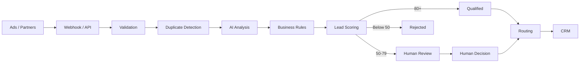

# LeadGuard

**AI-assisted Lead Qualification & Routing**

*🇬🇧 English · [🇫🇷 Lire en français](README.fr.md)*

A technical proof of concept: an internal platform that receives leads from
marketing campaigns, validates them, deduplicates them, enriches them with an
LLM, scores them against deterministic business rules, and routes the qualified
ones to the right sales team — with a full audit trail.

It covers six lines of business — heat pumps, solar, hearing aids, health
insurance, energy renovation and B2B IT — across France, Spain and Italy.
**One pipeline, six sets of eligibility criteria**: that split is the heart of
the design, and the section below explains why.

---

## Problem

Marketing teams receive a high volume of leads from many sources: Google Ads,
Meta Ads, partner forms, affiliate platforms. Those leads arrive in different
shapes, with uneven quality, duplicates, missing consent and free-text project
descriptions that no database column can represent.

Before a lead is worth a salesperson's time, it has to be validated,
deduplicated, enriched, qualified and routed. Doing that by hand does not scale;
doing it with a single opaque model is not auditable.

## Solution

LeadGuard demonstrates an AI-assisted qualification pipeline that combines
**LLM-based information extraction** with **deterministic business rules**.

The split is the central design decision:

```
Free text ──► AI extraction ──► Structured information
                                        │
                                        ▼
                              Deterministic rules
                                        │
                                        ▼
                                    Scoring
                                        │
                                        ▼
                          Human validation when needed
```

The LLM is used exactly where it adds value — turning "j'ai acheté une maison
près de Lyon et je voudrais remplacer ma chaudière fioul par une pompe à
chaleur avant l'hiver" into `{project_type: heat_pump, location: Lyon,
urgency: high, ...}`.

**The AI never decides whether a lead is accepted or rejected.** That decision
is made by rules with fixed weights, whose every step is written to an audit
trail with a human-readable reason. This is deliberate: business-critical
decisions must be explainable, reproducible and testable. An LLM is none of
those three.

---

## Six verticals, one pipeline

A lead-generation business does not qualify every vertical the same way. A heat
pump lead is worth nothing without property ownership; a B2B IT lead is worth
nothing without decision-making power. Neither criterion means anything in the
other vertical.

So the rules come in two families:

| | Weight | Applies to |
|---|---:|---|
| **Universal rules** | 68 | every lead, in every vertical |
| **Vertical eligibility rules** | 32 | only the lead's own line of business |
| **Total** | **100** | so the score always reads as a percentage |

Each vertical defines its own three or four criteria:

| Vertical | Eligibility criteria |
|---|---|
| **Heat pump** | ownership · current heating system **and its age** · surface and property type · budget realism |
| **Solar** | ownership of the roof concerned · roof cover and dominant orientation · self-consumption or surplus resale · budget realism |
| **Hearing aids** | the difficulty is **declared by the person themselves** · age bracket and whether they are accompanied · complementary health cover |
| **Health insurance** | nature of the need (health / provident / borrower) · household and number of beneficiaries · current contract and its renewal date |
| **Energy renovation** | owner-occupier or landlord · property age and type · nature of the planned works · budget realism |
| **B2B IT** | the contact's role and **decision-making power** · company size and sector · nature of the project (software, managed services, cybersecurity, cloud) |

Three consequences worth pointing out:

**Ownership is not a universal rule.** It is an eligibility criterion for the
three property verticals and does not exist in the other three — otherwise an
IT director would lose 15 points for not owning a house. There is a test for
exactly that.

**Budget is only a criterion where it means something.** It is scored against a
reference cost *for that vertical* (a heat pump ≈ 15 000 €, solar ≈ 12 000 €),
and there is no budget rule at all for hearing aids, health insurance or B2B IT.

**A lead whose vertical cannot be identified is capped at 68/100.** Not by a
special case — simply because the eligibility third of the scale was never run.
It therefore can never be automatically qualified, and the audit trail says so
in words: *"no vertical identified, so the eligibility criteria could not be
checked"*.

For hearing aids and health insurance the lead touches health data, which is a
special category under GDPR. That is why the hearing aid vertical carries its
strictest rule: an enquiry made by a relative on someone else's behalf is not a
qualified lead, because the person concerned has neither expressed the need nor
consented to their data being processed.

---

## Architecture



Both entry points converge on a single pipeline, so the business logic exists
exactly once:

```
Manual API  ──┐
              ├──► lead_service.process_lead()  ──►  validation
Webhook     ──┘                                      consent & fingerprint
                                                     duplicate detection
                                                     AI extraction
                                                     business rules
                                                     scoring & decision
                                                     routing
                                                     CRM sync
                                                     audit trail
```

### Project layout

```
backend/
├── app/
│   ├── main.py                     FastAPI app, lifespan, DI wiring
│   ├── config.py                   every threshold and toggle, in one place
│   ├── api/
│   │   ├── leads.py                POST /api/leads, list, detail, stats
│   │   ├── webhooks.py             per-source payload adapters
│   │   ├── reviews.py              human-in-the-loop endpoints
│   │   ├── fake_crm.py             simulated downstream CRM
│   │   ├── deps.py                 injectable AI provider & CRM client
│   │   └── serializers.py          model → response mapping
│   ├── models/                     Lead, LeadEvent, enums + vertical mapping
│   ├── schemas/lead.py             Pydantic contracts
│   ├── services/
│   │   ├── lead_service.py         THE pipeline orchestrator
│   │   ├── duplicate_service.py    two-tier duplicate detection
│   │   ├── fingerprint.py          SHA-256 integrity fingerprint
│   │   └── audit_service.py        append-only event trail
│   ├── qualification/
│   │   ├── rules.py                universal + per-vertical rule registries
│   │   ├── scoring.py              aggregation + score → status
│   │   └── engine.py               runs the rules; contains no I/O
│   ├── ai/
│   │   ├── base.py                 AIProvider ABC + shared prompt
│   │   ├── mock_provider.py        deterministic, no API key needed
│   │   ├── anthropic_provider.py
│   │   ├── openai_provider.py
│   │   └── factory.py              selection + graceful degradation
│   ├── routing/router.py           routing keyed on vertical, then geography
│   ├── integrations/crm.py         retry, timeout, failure isolation
│   └── db/
│       ├── session.py              async engine/session
│       └── seed.py                 demo data
└── tests/                          142 tests, no network required

frontend/
└── src/
    ├── pages/                      Dashboard, NewLead, LeadDetail, Reviews, Crm
    ├── components/common.jsx       score, badges, rule checks, timeline
    └── api/client.js
```

---

## Installation

### Option 1 — Docker (one command)

```bash
docker compose up --build
```

* Frontend: <http://localhost:3000>
* API docs: <http://localhost:8000/docs>

Runs PostgreSQL, the API and the frontend behind nginx. Because
`SEED_ON_STARTUP=true`, the database is **reset to the demo dataset on every
start** — so the dashboard is always populated and every demo run begins from
the same clean state. Set it to `false` in `docker-compose.yml` to keep leads
between restarts.

If port 8000 or 3000 is already taken on your machine:

```bash
BACKEND_PORT=8010 FRONTEND_PORT=3001 docker compose up --build
```

### Option 2 — Local (SQLite, no Docker)

```bash
# Backend
cd backend
python3 -m venv .venv && source .venv/bin/activate
pip install -r requirements-dev.txt
python -m app.db.seed                 # optional: demo data
uvicorn app.main:app --reload         # http://localhost:8000

# Frontend (in another terminal)
cd frontend
npm install
npm run dev                           # http://localhost:5173
```

No API key is required: `AI_PROVIDER=mock` is the default and the mock provider
is a fully functional, deterministic extractor.

If port 8000 is taken, run the API elsewhere and point the dev proxy at it:

```bash
uvicorn app.main:app --port 8010
VITE_API_TARGET=http://localhost:8010 npm run dev
```

### Configuration

Copy `backend/.env.example` to `backend/.env` and adjust. Everything worth
tuning is a setting: thresholds, rule behaviour, duplicate penalty, CRM retry
and timeout, AI provider.

To use a real LLM:

```bash
AI_PROVIDER=openai
OPENAI_API_KEY=sk-...
```

or

```bash
AI_PROVIDER=anthropic
ANTHROPIC_API_KEY=sk-ant-...
```

> `.env` is in `.gitignore`: your key is never committed.
> Run `uvicorn` **from the `backend/` directory** so the `.env` is picked up.

### Tests

```bash
cd backend
python -m pytest              # 142 tests, ~5s, no network, no API key
```

---

## Endpoints

| Method | Path | Purpose |
|---|---|---|
| `POST` | `/api/leads` | Submit a lead and run the full pipeline |
| `GET` | `/api/leads` | List leads (`?status=QUALIFIED\|REVIEW\|REJECTED`) |
| `GET` | `/api/leads/{id}` | Full detail: AI analysis, rules, routing, audit trail |
| `GET` | `/api/leads/stats` | Dashboard counters |
| `POST` | `/api/webhooks/leads` | Receive a lead from an external platform |
| `GET` | `/api/reviews` | Leads awaiting human review |
| `POST` | `/api/reviews/{id}` | Record a human decision |
| `POST` | `/api/fake-crm/leads` | Simulated CRM intake |
| `GET` | `/api/fake-crm/leads` | Inspect what the CRM received |
| `GET` | `/api/config` | Live thresholds, rule weights, demo personas |
| `GET` | `/health` | Health check |

### Example

```bash
curl -X POST http://localhost:8000/api/leads \
  -H 'Content-Type: application/json' \
  -d '{
    "firstname": "Thomas",
    "lastname": "Martin",
    "email": "thomas.martin@email.fr",
    "phone": "0612345678",
    "postal_code": "69003",
    "source": "google_ads",
    "campaign": "PAC_Lyon",
    "project_description": "J'\''ai acheté une maison près de Lyon et je souhaite remplacer ma chaudière fioul par une pompe à chaleur dans ma maison de 120m2 avant l'\''hiver.",
    "owner": true,
    "budget": 12000,
    "consent": true
  }'
```

Response (abridged):

```json
{
  "public_id": "LD-2026-0014",
  "score": 94,
  "status": "QUALIFIED",
  "vertical": "heat_pump",
  "team": "PAC Lyon",
  "crm_status": "SUCCESS",
  "duplicate": { "duplicate": false, "reason": "No duplicate found" },
  "ai_analysis": {
    "project_type": "heat_pump",
    "location": "Lyon",
    "property_type": "house",
    "owner_intent": true,
    "urgency": "high",
    "purchase_intent": "high",
    "summary": "Prospect interested in a heat pump project: ...",
    "provider": "mock",
    "details": {
      "heating_system": "oil_boiler",
      "heating_age_years": null,
      "surface_m2": 120
    }
  }
}
```

And the audit trail it produced:

```
12:32:59  Lead received from google_ads (campaign PAC_Lyon) via api
12:32:59  Validation passed: all required fields present and well-formed
12:32:59  Consent verified and timestamped at 2026-09-09 10:32:59 UTC
12:32:59  Duplicate check passed
12:32:59  AI analysis completed by 'mock': project=heat_pump, urgency=high, intent=high, details={'heating_system': 'oil_boiler', 'heating_age_years': None, 'surface_m2': 120}
12:32:59  Score calculated: 94/100 (10 checks: universal + heat_pump)
12:32:59  Status set to QUALIFIED: Score 94 is at or above the qualification threshold (80)
12:32:59  Routed to PAC Lyon: Heat pump project located in the Rhône-Alpes area
12:32:59  CRM synchronization successful (reference CRM-C07301DF)
```

### Webhooks

The same pipeline accepts platform-native payloads. Each source has a small
adapter that maps its field names onto the internal schema — Google Ads'
`user_column_data`, Meta Ads' `field_data`, French partner forms
(`prenom`/`nom`/`telephone`), and a generic fallback. Values are coerced along
the way (`"yes"` → `true`, `"12 000 €"` → `12000.0`).

```bash
curl -X POST http://localhost:8000/api/webhooks/leads \
  -H 'Content-Type: application/json' \
  -d '{
    "source": "google_ads",
    "campaign_name": "PAC_Lyon",
    "user_column_data": [
      {"column_id": "FIRST_NAME", "string_value": "Thomas"},
      {"column_id": "EMAIL", "string_value": "thomas.martin@email.fr"},
      {"column_id": "PHONE_NUMBER", "string_value": "0612345678"},
      {"column_id": "POSTAL_CODE", "string_value": "69003"}
    ],
    "project_description": "Pompe à chaleur pour ma maison avant l'\''hiver",
    "owner": "true", "budget": "12 000 €", "consent": "yes"
  }'
```

---

## The qualification pipeline

### 1. Validation

Pydantic validates **shape and presence**: required fields, a parsable email, a
non-empty description, a non-negative budget. A structurally broken payload
gets a `422` and never becomes a lead.

### 2. Consent & traceability

Every lead stores its consent flag, a consent timestamp, its source and a
**SHA-256 fingerprint** of the identifying fields:

```python
hashlib.sha256(json.dumps(data, sort_keys=True).encode()).hexdigest()
```

The free-text description is deliberately excluded, so reformatting the message
does not change the lead's identity. `sort_keys=True` makes the digest
independent of dict ordering.

### 3. Duplicate detection

Two tiers, cheapest first, and always **before** the insert so a lead is never
compared against itself:

1. Exact match on a **normalised** email or phone (`+33 6 12 34 56 78` and
   `0612345678` hash to the same key) → 94-100% similarity.
2. Weak signals requiring two agreeing dimensions — fuzzy name match *and*
   postal code — to avoid false positives.

The candidate set is narrowed in SQL on indexed normalised columns, then scored
precisely in Python.

### 4. AI analysis

The provider gets one job: free text in, structured fields out.

```python
class AIProvider(ABC):
    @abstractmethod
    async def analyze_lead(self, lead: LeadCreate) -> AIAnalysis: ...
```

Three implementations share one prompt and one output schema:
`MockAIProvider` (deterministic keyword matching, no key), `AnthropicProvider`
and `OpenAIProvider` (both using structured JSON output).

Alongside the fields every lead has, the provider returns a `details` bag
holding the fields that only matter for one vertical — heating system and its
age, roof cover and orientation, decision-making power, contract renewal date.
It is one JSON column rather than twenty nullable ones, because each vertical
uses a different handful. Extraction is scoped: a heat pump lead is never asked
about roof orientation.

A provider outage never loses a lead: `analyze_safely` catches and times out,
returning a neutral analysis. The rules then score the structured fields the
prospect submitted and the lead simply lands in human review.

### 5. Business rules

Each rule is a small pure function returning **points, a verdict and a reason**,
registered in one list. Adding or reweighting a rule is a one-line change and
requires no modification to the engine.

```json
{
  "rule": "owner_check",
  "passed": true,
  "score": 15,
  "max_score": 15,
  "reason": "Lead is a property owner"
}
```

**Universal rules — 68 points, every lead**

| Rule | Max | What it checks |
|---|---:|---|
| `consent_check` | 20 | GDPR consent granted — the heaviest single rule |
| `project_consistency_check` | 12 | Identifiable vertical **and** a substantive description |
| `purchase_intent_check` | 10 | High (10) / medium (5) / low (0) — from AI extraction |
| `urgency_check` | 10 | High (10) / medium (5) / low (0) — from AI extraction |
| `email_check` | 8 | Valid, non-disposable domain |
| `phone_check` | 8 | Valid number **for the lead's own country** (FR / ES / IT) |
| `duplicate_check` | −40 | penalty-only: it can subtract but never add |

**Vertical eligibility rules — 32 points, the lead's own vertical**

| Vertical | Rules and weights |
|---|---|
| Heat pump | `hp_owner` 11 · `hp_current_heating` 8 · `hp_property` 6 · `hp_budget` 7 |
| Solar | `pv_roof_owner` 11 · `pv_roof_profile` 7 · `pv_usage_model` 7 · `pv_budget` 7 |
| Hearing aids | `ha_self_declared` 12 · `ha_age_context` 10 · `ha_coverage` 10 |
| Health insurance | `hi_need_type` 11 · `hi_household` 10 · `hi_contract_timing` 11 |
| Energy renovation | `er_owner_type` 10 · `er_property_age` 8 · `er_works_type` 7 · `er_budget` 7 |
| B2B IT | `b2b_decision_power` 12 · `b2b_company_profile` 10 · `b2b_project_type` 10 |

Rules are graded, not binary, wherever the business reason is real. The heat
pump criterion is the current system **and its age**: naming the system earns
5 of 8, naming both earns all 8. That is why Thomas scores 94 rather than
100 — see *Technical choices*.

### 6. Decision

```
score >= 80          → QUALIFIED
50 <= score < 80     → REVIEW
score < 50           → REJECTED
```

Thresholds live in `config.py` and are overridable by environment variable.
A suspected duplicate is capped at `REVIEW` and never auto-qualified — a human
confirms whether it is a genuine re-engagement or a double submission.

### 7. Human in the loop

The reviewer's verdict is stored **alongside** the engine's, never on top of it:

```json
{
  "system_status": "REVIEW",
  "human_status": "QUALIFIED",
  "reviewer": "demo-user",
  "reviewed_at": "2026-09-09T14:31:21",
  "review_reason": "Ownership confirmed by phone"
}
```

Keeping both is what lets you audit decisions and, later, measure how often
humans disagree with the engine — the signal you would use to retune the
weights. The score is never rewritten. A human upgrade to `QUALIFIED` triggers
the same downstream flow as an automatic one: routing, then CRM sync.

### 8. Routing

A declarative rule list evaluated top to bottom, first match wins, with an
always-true fallback so a qualified lead is never orphaned.

```json
{ "team": "PAC Lyon", "reason": "Heat pump project located in the Rhône-Alpes area" }
```

Routing keys on the vertical first — each one is bought by a different client
team — then refines by geography or deal shape:

* **Country first.** A Spanish lead goes to the *Iberia Desk* and an Italian one
  to the *Italy Desk*, before any French regional split is considered.
* **Heat pump** → *PAC Lyon* (Rhône-Alpes), *PAC Paris* (Île-de-France),
  *PAC National* elsewhere.
* **Solar** → *Solar South* in the high-irradiation départements, *Solar
  National* elsewhere.
* **Energy renovation** → *Renovation Global* for a whole-home project,
  *Renovation National* for a single measure.
* **Hearing aids** → *Audio Île-de-France* or *Audio National*, following the
  fitting-centre network.
* **Health insurance** → *Assurance Emprunteur*, *Prévoyance* or *Santé
  Individuelle*, by the nature of the need.
* **B2B IT** → *IT Enterprise* or *IT SMB*, by company size.
* **No vertical** → *General Sales*.

A test asserts that every vertical has a desk of its own, so a new vertical can
never silently fall through to the general desk.

### 9. CRM synchronization

Only `QUALIFIED` leads are pushed. The client has a timeout, bounded retry with
exponential backoff, and structured logging — but the important property is
**failure isolation**: a CRM outage is recorded as `crm_status=FAILED` with the
error and the reason on the audit trail. The intake request still returns `201`
and the lead stays qualified in LeadGuard, ready to be re-pushed. A downstream
outage must never lose a lead.

### 10. Audit trail

Append-only `lead_events` rows — `event_type`, `message`, JSON `metadata`,
`created_at` — written atomically with the state change they describe. Nothing
is ever updated or deleted: the trail is the evidence that a decision was taken
for the stated reasons.

---

## Demo (about 3 minutes)

```bash
docker compose up --build      # or the local option above
```

The dashboard opens with seeded volume and a review history. The three demo
personas are deliberately **not** seeded — you create them live, and the
**New lead** page has a prefill button for each so you never type 11 fields.

| Step | Action | Expected result |
|---|---|---|
| 1 | **New lead** → prefill *Thomas — heat pump, excellent* → submit | `94/100` · **QUALIFIED** · PAC Lyon · CRM SUCCESS |
| 2 | Open the lead detail | AI extraction **including the heat-pump-specific fields** (`heating_system: oil_boiler`, `surface_m2: 120`), the 10 rule checks with reasons, routing, and the 9-step audit trail |
| 3 | Prefill *Laura — solar, incomplete* → submit | `72/100` · **REVIEW**. Her roof cover, orientation and self-consumption model were all extracted and credited; *"Roof ownership not confirmed"* and *"No budget provided"* are what hold her back |
| 4 | Click **QUALIFY** on Laura | system `REVIEW` + human `QUALIFIED` both kept, routed to Solar South, CRM synced, decision on the trail |
| 5 | Prefill *Thomas* again → submit | **Potential duplicate detected** — existing lead `LD-…`, similarity 100% · score `54` (94 − 40) · capped at REVIEW |
| 6 | Prefill *Marco — no vertical, poor* → submit | `8/68` · **REJECTED**. The audit trail says *"no vertical identified, so the eligibility criteria could not be checked"* — the cap is the design, not a special case |
| 7 | Prefill *Bernard — enquiring for a relative* → submit | `66/100` · **REVIEW** — *"Enquiry made on behalf of a third party: the person concerned has not declared the difficulty themselves"*. The strictest rule in the hearing aid vertical |
| 8 | Prefill *Kevin — IT B2B, no authority* → submit | `67/100` · **REVIEW** — *"Contact influences but does not decide: a decision-maker is still needed"*. Same pipeline, completely different criteria |
| 9 | **Dashboard** | the **By vertical** table: volume, qualification rate and average score per line of business |
| 10 | **CRM** tab | exactly the qualified leads, with their CRM references |

Two personas to compare side by side, because they make the architecture
visible in ten seconds: **Sylvie** (IT B2B, decision-maker, 100/100) and
**Kevin** (IT B2B, technician, 67/100). Same vertical, same pipeline — the
difference is one eligibility criterion, and the score names it.

### The one branch the script above does not touch

CRM failure. Set `CRM_FAIL_RATE=1` (in `backend/.env`, or on the `backend`
service in `docker-compose.yml`) and submit a good lead:

* the request still returns `201`
* the lead is still `94/100`, `QUALIFIED` and routed to PAC Lyon
* the detail page shows an amber **CRM synchronization failed** banner
* the audit trail records the failure, the attempt count, and that the lead is
  retained in LeadGuard

That is the point worth making out loud: a downstream outage degrades the
integration, not the qualification.

---

## Technical choices

**Why validation and scoring are separate layers.** The brief asks both to
"reject invalid data" and to award points for "valid phone" and "consent".
Those are two different questions. Pydantic guards the transport contract; a
malformed request gets `422`. But a lead with a badly formatted phone and no
consent is *not* a malformed request — it is a **poor-quality lead**, which is
information worth storing. So it is persisted, scored, `REJECTED`, and fully
auditable. If phone format were a Pydantic constraint, that lead could never
exist, and you could never report on how many leads a campaign wastes.

**Why the weights sum to exactly 100 in every vertical.** 68 universal + 32
vertical-specific, whichever line of business the lead belongs to, so the score
reads directly as a percentage with no normalisation step. A test enforces the
invariant, which means adding a seventh vertical cannot silently break the
scale.

Note that a *realistic* excellent lead scores 94, not 100. Thomas names his oil
boiler but never says how old it is — and the criterion is the system **and its
age** — so that rule awards 5 of 8. His 12 000 € budget is also below the
~15 000 € reference for a heat pump, so the budget rule gives partial credit
too. Graded rules with real business justifications beat binary ones: they make
the score informative rather than a checkbox count, and they tell a salesperson
what to ask about first.

**The score does not validate the lead — it orders the queue.** Worth being
explicit, because "human-validated, not algorithm-scored" is a reasonable
position for a lead vendor to hold. Nothing here contradicts it: the score's job
is to rank what a human should look at first, and to pre-fill *what to check* —
Laura's screen says "roof ownership not confirmed" rather than making a
reviewer re-read her message. If the policy is that **every** lead passes a
person, that is one setting: put `QUALIFIED_THRESHOLD` above 100 and the
automatic path is closed, with no code change. There is a test for that too.

**Why phone validation is country-aware.** Operating in France, Spain and Italy
means a Spanish mobile must not be judged against the French numbering plan —
it would fail, cost the lead 8 points, and the reason string would be a lie.
Each country gets its own pattern, and the failure message names the country.

**Why the AI is fenced off.** `AIProvider` is an ABC with one method that
returns a Pydantic model. The engine consumes those fields and nothing else —
it cannot see a prompt, a token or a provider name. Consequences: the whole
test suite runs offline against the mock; swapping vendors touches one config
line; and an AI outage degrades to "score on submitted data, send to human
review" instead of failing.

**Why async SQLAlchemy 2.0.** The pipeline is I/O-bound end to end (AI call,
CRM call, database) so it is async throughout. `DATABASE_URL` selects the
driver: `sqlite+aiosqlite` for a zero-setup local demo, `postgresql+asyncpg`
in Docker. Both paths are verified.

**Why dependency injection for the AI provider and CRM client.** Both hang off
`app.state` and are resolved via `Depends`, which is what makes
"a CRM outage doesn't crash the app" a real test rather than a claim — the test
injects a transport that always times out.

**Why duplicate detection runs before the insert.** Otherwise the new lead is
in its own candidate set and matches itself. The matched lead's reference is
also denormalised onto the row, so serialising never has to traverse a
self-referential relationship (which the async ORM cannot eagerly load).

---

## Limitations (it is a POC)

* **No authentication or authorisation.** Every endpoint is open and the
  reviewer identity is a free-text string. A real system needs auth, and the
  reviewer would come from the session, not the request body.
* **No migrations.** Tables are created with `create_all` at startup; production
  needs Alembic.
* **CRM sync is synchronous and in-request.** Retries happen inside the HTTP
  request. A real system would enqueue the sync (Celery, ARQ, SQS) and retry
  out of band; the `crm_status` column is already the state machine for that.
* **The fake CRM stores leads in memory** and resets on restart.
* **Duplicate detection is exact-match plus a light heuristic.** No phonetic
  matching, no address normalisation, no probabilistic record linkage.
* **`MockAIProvider` is keyword matching, not NLP.** It is deliberately
  deterministic so the demo is reproducible. It covers **French** vocabulary
  for the six verticals and nothing more: a Spanish or Italian free-text
  description will be classified as `unknown` and capped at 68. Country-aware
  *validation* is implemented; country-aware *extraction* is not, and that is
  exactly the job a real LLM provider does better than a keyword list.
* **The vertical is inferred from free text.** A lead whose message is
  ambiguous lands in `unknown` and goes to a human. A production system would
  also use the campaign and the traffic source as priors — the campaign name is
  already stored, so the hook exists.
* **The real providers make no tested network calls** — that would require
  either a live key or heavy mocking. Their response *parsing* is tested,
  including against a malformed reply.
* **Rule weights are hand-tuned, not learned.** In production they would be
  fitted against actual conversion data — which is exactly why the system
  records both the engine's decision and the human's.
* **No rate limiting, webhook signature verification, or idempotency keys** on
  the public webhook endpoint. All three would be required before exposing it.
* **GDPR is demonstrated, not implemented.** Consent tracking and the integrity
  fingerprint are real; retention policies, the right to erasure and data
  export are not.

---

## Test coverage

142 tests, no network and no API key required.

| File | Covers |
|---|---|
| `test_qualification.py` | **68 + 32 == 100 for every vertical** · an unidentified vertical is capped and can never be auto-qualified · **ownership is not a universal rule, and the owner flag is provably ignored on a B2B lead** · the heat pump age criterion is graded · a north-facing roof scores zero · **a hearing aid enquiry made for a relative is blocked** · a B2B influencer without authority is blocked · budget exists only where it is a criterion · country-aware phone validation (FR/ES/IT) · the three personas hit their score bands · consent penalty · phone validation · duplicate penalty · **score never leaves 0-100** across every rule combination · penalty rules can never award points · thresholds are configurable · every rule gives a reason |
| `test_ai.py` | the brief's worked example parses correctly · accent-insensitive matching · project categorisation · vague text yields no invented intent · determinism · **outage and timeout degrade gracefully** · factory needs no key · real providers fail loudly without one · **a sloppy LLM response is parsed robustly** |
| `test_routing.py` | every vertical / region combination · health insurance routes on the need type · B2B routes on company size · **Spain and Italy take precedence over the French regional split** · **every vertical has a desk of its own** · project types roll up into the right vertical |
| `test_api_leads.py` | the vertical is resolved, stored and returned · a B2B rule never appears on a heat pump lead · qualified / review / rejected end to end · `422` only for structural problems · rejected leads are still stored · consent timestamping · fingerprint stability · **all 9 audit events in order** · duplicates by email, by phone, across phone formats · no false positives · stats |
| `test_reviews.py` | review queue · human qualify triggers routing + CRM · both decisions kept · trail entry · score never rewritten · no double review · `404`/`409`/`422` paths |
| `test_webhooks.py` | **webhook and API produce identical qualification** · Google Ads, Meta Ads and French partner payloads · envelope unwrapping · type coercion · unmappable payload gets `422` · cross-channel dedup |
| `test_crm.py` | success · retry then success · **retries are bounded** · error status · **a CRM outage does not crash intake** · only qualified leads are pushed |
